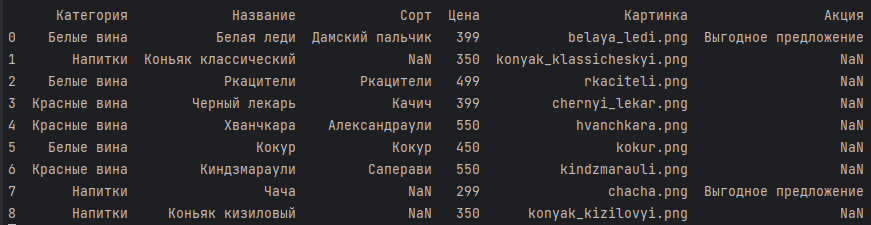

# Новое русское вино

Сайт магазина авторского вина "Новое русское вино".

## Запуск
- Скачайте архив с кодом ([ссылка для скачивания](https://github.com/DKonst21/wine-master)) и распакуйте его.
- Установите необходимые библиотеки
```
python3 -m pip install -r requirements.txt
```
- Запустите сайт командой:
```
python3 main.py
```
- Перейдите на сайт по адресу [http://127.0.0.1:8000](http://127.0.0.1:8000).
- После успешной установки и запуска, по указанному выше адресу должна отобразиться главная страница сайта.

## Данные

- Перечень продукции загружается из файла с названием '**wine_catalog.xlsx**', расположенном в корневой папке. Если файл находится во вложенной папке, то при запуске необходимо указать имя этой папки через аргументы '**-d**' или '**--dir**'. Например:
```
python3 main.py -dir newfolder
```

- Образец таблицы с исходными данными:



## Цели проекта

Код написан в учебных целях — это урок в курсе по Python и веб-разработке на сайте [Devman](https://dvmn.org).
